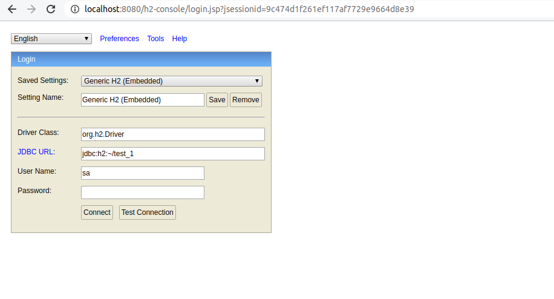

## Evil Server cloud 

Springboot microservice developed on Java that include srping security.

It used an embebed H2 database for include user and administration  roles.

## 1.0 Login Application

## 1.1 Administration H2 database

